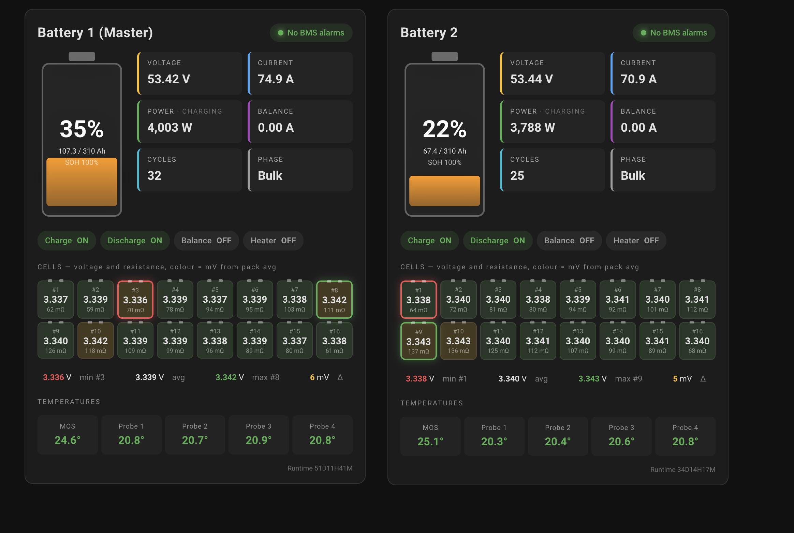

# Battery Pack Card

[](https://my.home-assistant.io/redirect/hacs_repository/?owner=SvenHamers&repository=battery-pack-card&category=plugin)



A visual Lovelace card for Home Assistant that renders a 4s–32s lithium battery pack — SOC silhouette, six headline stats, status pills for charge / discharge / balance / heater, a colour-coded per-cell array (voltage + internal resistance, tinted by deviation from pack average), min/max/avg/Δ summary line, and a temperature strip. Read-only: it never writes to the BMS.

Every region is clickable and opens the matching entity's more-info dialog.

## Works out of the box with…

…the [**jean-luc1203/jkbms-rs485-addon**](https://github.com/jean-luc1203/jkbms-rs485-addon) integration. The Basic configuration only needs a `prefix:` and you're done — all sensors, binary sensors, cell entities, temperatures and the alarm signals are derived automatically from that prefix and match the addon's default entity naming.

Using a different BMS? Use the **Advanced** tab to point each field at your own entities — every value on the card is independently overridable, including each individual cell.

## Install

### Via HACS (recommended)

[](https://my.home-assistant.io/redirect/hacs_repository/?owner=SvenHamers&repository=battery-pack-card&category=plugin)

Click the badge above — it opens your own Home Assistant with the HACS custom-repository dialog pre-filled. Press **ADD**, then download **Battery Pack Card** from the HACS Frontend list and hard-refresh the dashboard.

Or do it manually: HACS → Frontend → ⋮ → Custom repositories → add `https://github.com/SvenHamers/battery-pack-card` with category **Lovelace** → install **Battery Pack Card** → hard-refresh (Ctrl/Cmd+Shift+R).

### Manual

1. Copy `battery-pack-card.js` to `/config/www/`.
2. Settings → Dashboards → ⋮ → Resources → add `/local/battery-pack-card.js` as type **JavaScript module**.
3. Hard-refresh.

## Usage

Add via the UI: "Add Card" → search "Battery Pack Card", fill the form.

Or in YAML:

```yaml
type: custom:battery-pack-card
name: BMS Master
prefix: bms_master
alarm_prefix: bms_master_bms_master
cells: 16
```

The editor has two tabs:

- **Basic** — title, entity prefix, alarm prefix, cell count, and six toggles to show / hide each section.
- **Advanced** — per-entity overrides for every field, plus per-cell overrides and a pattern shortcut. See [Advanced configuration](#advanced-configuration).

## Configuration (Basic)

If you use the JK-BMS RS485 addon, `prefix` is the only required field.

| Option              | Type    | Default                     | Description                                                   |
| ------------------- | ------- | --------------------------- | ------------------------------------------------------------- |
| `prefix`            | string  | —                           | Entity prefix (e.g. `bms_master`). Optional if every `entity_*` override below is set instead. |
| `name`              | string  | `<prefix>`                  | Title shown in the card header.                               |
| `alarm_prefix`      | string  | `<prefix>_<prefix>`         | Prefix for `*_alarm_status` / `*_alarm_active`.               |
| `cells`             | integer | `16`                        | Number of series cells to render (4–32).                      |
| `show_battery`      | bool    | `true`                      | Show the SVG battery silhouette with SOC fill.                |
| `show_stats`        | bool    | `true`                      | Show the 6-tile stat grid.                                    |
| `show_pills`        | bool    | `true`                      | Show charge / discharge / balance / heater status pills.      |
| `show_cells`        | bool    | `true`                      | Show the per-cell voltage + resistance grid.                  |
| `show_summary`      | bool    | `true`                      | Show the min / avg / max / Δ summary line.                    |
| `show_temperatures` | bool    | `true`                      | Show the MOSFET + 4-probe temperature strip.                  |

## Advanced configuration

Every visible field on the card can be independently re-pointed to any entity in your Home Assistant — handy if your BMS uses a different naming scheme, if you want to mix sensors from multiple sources, or if some fields don't exist on your hardware. Any override left blank falls back to the prefix-derived default from the Basic tab.

In the dashboard editor open the card's "Edit" dialog and switch to the **Advanced** tab; you'll see grouped HA entity-pickers for every field. In YAML use any of the keys below.

### Pack metrics

| Key                          | Default (when `prefix: X`)                   | Description                  |
| ---------------------------- | -------------------------------------------- | ---------------------------- |
| `entity_soc`                 | `sensor.X_soc_pourcentage`                   | State of charge (%).         |
| `entity_soh`                 | `sensor.X_soh_pourcentage`                   | State of health (%).         |
| `entity_pack_voltage`        | `sensor.X_tension_totale_volt`               | Pack voltage (V).            |
| `entity_current`             | `sensor.X_courant_total`                     | Pack current (A).            |
| `entity_power`               | `sensor.X_puissance_totale`                  | Pack power (W).              |
| `entity_balance_current`     | `sensor.X_balance_courant`                   | Balance current (A).         |
| `entity_cycles`              | `sensor.X_nombre_cycle`                      | Cycle count.                 |
| `entity_capacity_remaining`  | `sensor.X_capacite_restante_ah`              | Remaining capacity (Ah).     |
| `entity_capacity_total`      | `sensor.X_capacite_batterie_ah`              | Total capacity (Ah).         |
| `entity_runtime`             | `sensor.X_total_runtime_formatted`           | Pre-formatted runtime text.  |
| `entity_charge_phase`        | `sensor.X_charge_status_text`                | Charge phase (Bulk / Absorb / …). |

### Cell summary

| Key                          | Default                                      | Description                  |
| ---------------------------- | -------------------------------------------- | ---------------------------- |
| `entity_cell_voltage_avg`    | `sensor.X_cell_voltage_average`              | Average cell voltage (V).    |
| `entity_cell_voltage_min`    | `sensor.X_cell_voltage_min_value`            | Lowest cell voltage (V).     |
| `entity_cell_voltage_max`    | `sensor.X_cell_voltage_max_value`            | Highest cell voltage (V).    |
| `entity_cell_voltage_delta`  | `sensor.X_cell_voltage_delta`                | Max − min (V).               |
| `entity_cell_min_number`     | `sensor.X_cell_voltage_min_number`           | Index of the lowest cell.    |
| `entity_cell_max_number`     | `sensor.X_cell_voltage_max_number`           | Index of the highest cell.   |

### Status

| Key                          | Default (when `alarm_prefix: Y`, `prefix: X`) | Description                  |
| ---------------------------- | --------------------------------------------- | ---------------------------- |
| `entity_alarm_status`        | `sensor.Y_alarm_status`                       | Alarm status text.           |
| `entity_alarm_active`        | `binary_sensor.Y_alarm_active`                | Any alarm currently active.  |
| `entity_switch_charge`       | `binary_sensor.X_switch_charge`               | Charge MOSFET ON / OFF.      |
| `entity_switch_discharge`    | `binary_sensor.X_switch_decharge`             | Discharge MOSFET ON / OFF.   |
| `entity_switch_balance`      | `binary_sensor.X_switch_balance`              | Balancer enabled by user.    |
| `entity_balance_active`      | `binary_sensor.X_balance_action`              | Balancer actively balancing. |
| `entity_heating`             | `binary_sensor.X_heating`                     | Heating element on / off.    |

### Temperatures

| Key                          | Default                                      | Description                  |
| ---------------------------- | -------------------------------------------- | ---------------------------- |
| `entity_temp_mos`            | `sensor.X_mos_temp`                          | MOSFET / power-stage temp.   |
| `entity_temp_probe_1`        | `sensor.X_sonde_1_temp`                      | External probe 1 temp.       |
| `entity_temp_probe_2`        | `sensor.X_sonde_2_temp`                      | External probe 2 temp.       |
| `entity_temp_probe_3`        | `sensor.X_sonde_3_temp`                      | External probe 3 temp.       |
| `entity_temp_probe_4`        | `sensor.X_sonde_4_temp`                      | External probe 4 temp.       |

### Per-cell entities

For each cell `n` (1..`cells`) the card resolves the voltage and resistance entities in this order:

1. **Explicit per-cell override** — `entity_cell_<n>_volt` / `entity_cell_<n>_ohm`
2. **Pattern shortcut** — `cell_voltage_pattern` / `cell_resistance_pattern`, with `{n}` substituted by the cell index
3. **Prefix default** — `sensor.<prefix>_cell_<n>_volt` / `sensor.<prefix>_cell_<n>_ohm`

| Key                              | Description                                                  |
| -------------------------------- | ------------------------------------------------------------ |
| `entity_cell_<n>_volt`           | Voltage entity for cell `<n>`. Takes precedence over pattern and prefix default. |
| `entity_cell_<n>_ohm`            | Internal resistance entity for cell `<n>`.                   |
| `cell_voltage_pattern`           | Pattern for every cell's voltage entity. `{n}` is replaced by the cell index. |
| `cell_resistance_pattern`        | Pattern for every cell's resistance entity.                  |

The Advanced tab shows individual entity-pickers for cells 1..N (changes when you adjust `cells`).

Example — use the BMS addon for most things, a shunt for power, and a custom cell naming:

```yaml
type: custom:battery-pack-card
name: My pack
prefix: bms_a
entity_power: sensor.shunt_power                       # use shunt instead of BMS-reported W
cell_voltage_pattern: sensor.bms_a_cell{n}_voltage     # different cell naming
entity_cell_5_volt: sensor.special_probe_for_cell_5    # one-off override on top of the pattern
```

## Conventions

- **Power sign:** positive = charging (energy into the battery), negative = discharging. This matches JK-BMS and most modern BMS integrations.
- **Cell colouring:** cells are tinted by their offset from the pack's average voltage — green ≤ 2 mV, yellow ≤ 5, orange ≤ 10, red beyond. The lowest and highest cells get a red and green halo respectively.
- **Click-to-detail:** every visible element (battery, stat tile, pill, individual cell, temperature tile, alarm badge) opens HA's standard entity-detail dialog.
- **Read-only:** the card never writes to the BMS. All `number.*` and `switch.*` settings entities are deliberately ignored.

## License

MIT.
